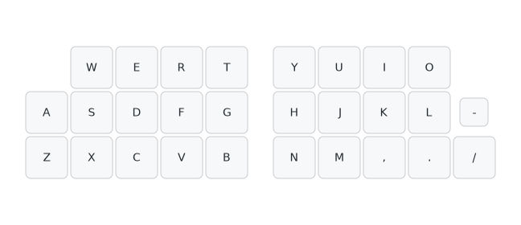

このリポジトリは設計者向けに公開しています。

+ 総合案内は[こちら](https://github.com/nazuna293/Enigma_04)です。
+ ユーザー向けのファームウェア(リポジトリ)は[こちら](https://github.com/nazuna293/zmk-Enigma_04_kbd-user-config)です。

## 初期キーマップ
### Tap Dance
|name|tap|hold|2tap|tap hold|
|:-:|:-:|:-:|:-:|:-:|
|tp1|半／全|layer to_ALT|||
|tp2|F7|layer to_ALT|F8||
|tp3|space|layer Tenkey|B(/)||
|tp4|:||;||
|Sft||Shift||layer to_Shift|
|Ctl||Ctrl||layer to_Ctrl|
|Win||Win||layer to_Win|
|Alt||Alt||layer to_Alt|

※レイヤー to_○○に推移している間は○○キーが押されている状態になっています。

