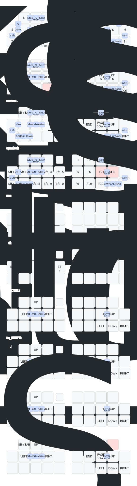

このリポジトリは設計者向けに公開しています。

+ 総合案内は[こちら](https://github.com/nazuna293/Enigma_04)です。
+ ユーザー向けのファームウェア(リポジトリ)は[こちら](https://github.com/nazuna293/zmk-Enigma_04_kbd-user-config)です。

## 初期キーマップ
### Tap Dance
|name|tap|hold|2tap|tap hold|
|:-:|:-:|:-:|:-:|:-:|
|td1|半／全|layer to_ALT|||
|td2|F7|layer to_ALT|F8||

※レイヤーに推移している間はALTキーが押されている状態になっています。

